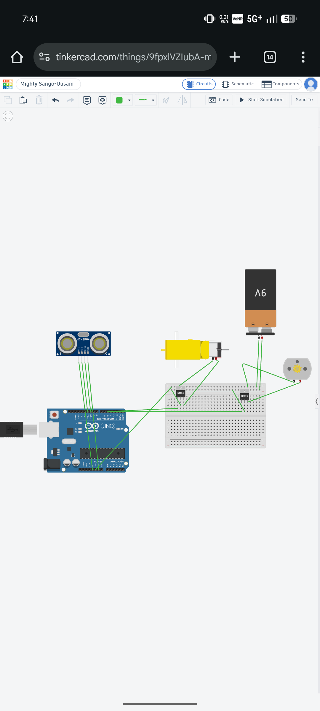

# 🤖 Obstacle Avoiding Robot

A budget-friendly obstacle-avoiding robot designed and programmed using Arduino.

## 🚧 Project Status

Currently developed and tested as a simulation in Tinkercad.

## 🧠 How It Works

The ultrasonic sensor continuously measures the distance in front of the robot.

When an obstacle is detected within a defined distance, the Arduino stops the robot and changes its direction according to the programmed logic.

## 🛠️ Components

- Arduino
- Ultrasonic distance sensor
- DC motors
- Motor control circuit
- Battery
- Robot chassis

## 💻 Programming

- Arduino C/C++
- Tinkercad Circuits

## 🎯 Goal

The goal of this project is to turn my own robot design into a working physical prototype and improve it through testing and debugging.

## 🔮 Future Improvements

- Build the physical prototype
- Improve obstacle detection
- Improve turning decisions
- Optimize the motor control
- Test the robot in different environments

## 📸 Simulation

## ⚙️ Design Approach

This project was designed with a focus on keeping the robot simple and affordable.

The initial prototype is being developed in Tinkercad before moving to physical hardware.

## 🧪 Testing

The robot is currently being tested through simulation.

The main behavior being tested is:

Forward → Detect obstacle → Stop → Turn → Continue

## 📚 What I Learned

- Ultrasonic distance measurement
- Arduino programming
- Motor control
- Basic transistor/MOSFET switching
- Circuit simulation
- Debugging and testing
- Documenting an engineering project

## 🚀 Project Progress

- [x] Design robot concept
- [x] Create Tinkercad simulation
- [x] Write Arduino code
- [x] Upload code to GitHub
- [x] Document circuit design
- [x] Add simulation screenshot
- [ ] Build physical prototype
- [ ] Test physical motors
- [ ] Debug hardware
- [ ] Improve turning mechanism
